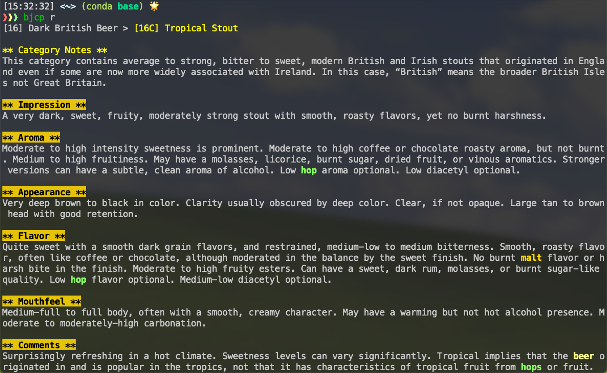

# About

Command line-based BJCP content learning tool.

Implemented with Python and Click

# How To Use

1. `git clone` for your local machine
2. `cd` into the directory
3. `pip install -r requirements.txt`
4. at the dictionary project root, `pip install --editable .`
5. `bjcp --help` to see the available commands

# TODO

- [ ] More fragmented learning features
- [ ] Display beautification (tables, etc.)
- [ ] Custom configuration

# Acknowledgements

- [BJCP 2021 Parsed Style Guidelines](https://github.com/bjcp-brasil/styleguide-2021) for the BJCP JSON datas